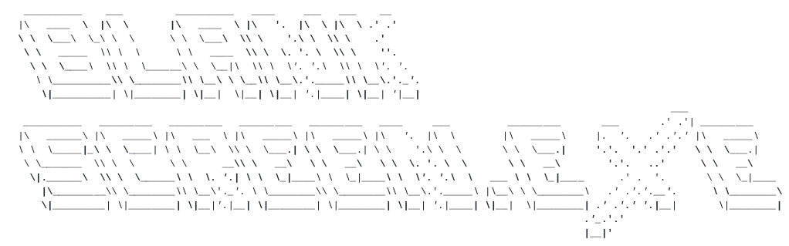

Coded by:

      
-------------------------------
## AIM/Objective

This program aims to take relevant inputs in order to plot a Linear-regression using a matplotlib graph.
This program also misbehaves on wrong inputs.
Like if you would enter alphabets instead of numbers when required
This program also shuts down itself on multiple instances if too many wrong inputs are provided.
Good luck Having fun with this program!

## Program Specs
This program is writen in Python 3.8.6
Date finished: 5 Oct 2020
Modlues Imported:
1. matplotlib
2. time

NOTE: Yeah! Those are the only ready made stuff I've used. Everything else is my doing.
No machine learning is used.

## Basic algorithm followed by the program

1. Input will be taken for observation range
2. List will be made for all "x" inputs
3. List will be made for all "y" inputs
4. User will be presented with the final table of both "x" and "y" values (original plots)
5. User will be presented with the final table of both "x" and "y hat" values (regression plots)
6. Some calculations will be done and user will be presented with a Graph\
7. User will need to take a screen shot of the grapht if they like and close the Graph window to proceed further.
8. User will be asked if they want to see additional information
9. If yes, A menu will appear from which the user can select any inference they like.
10. After user is done with observation, exiting seqence will follow.
11. User will be humiliated if they have a high error count 

## Instructions to run
Download these things:
1. python 3.8.6 from official site
2. matplotlib library using pip
3. pyinstaller for making .exe file

## MODULE SPECS
### Calculation.py   
	Sxy(x,y)		
	Sxx(x)			
	a1(Sxx,Sxy)		--slope
	a0(x,y)		--Y-intercept
	y_Hat(x,y)		--regression plots for Y
	axb(lst1,lst2)		--multiplies corresponding values of both list params
	list_sum(lst)		--summation of  alist
	list_square(lst)	--square of a list
	list_mean(var)		--mean of a list
	
	EXTRA FUNCTIONS:
	R(x,y)			--Correlation coefficient	
	SSE(x,y)		--summation of squared error
	SSR(x,y)  		--summation of squared regression
	SST(y)			--summation of squared total
### Tools.py   
	verify(inpt,typ="int")	--verifies input and return True or False
	numOobs()		--takes number of observations. Specific scenario only
	DTpt(Obs_num,varName)	--makes a list of datapoints
	graphCreds()		--sets graph credentials. Specific scenario only
	MenuSelection()	--gives a menu selection algorithm. Specific scenario only
	TotalErr_Tools()	--calculates total error from the Tools module. Specific scenario only
### Graphmaker.py   
	daPlot(x,y,TITLE,XLABEL,YLABEL,TEXT)	--plots graph with prespecified conditions
	Originalplots(Bind)	--displays original plots
	Regressionplots(Bind)	--displays regression plots
	CoffR(X,Y)		--displays Correlation coefficient
	CoffR2(X,Y)		--displays Coefficient of determination
	SumSqErr(X,Y)		--displays Error Analysis
